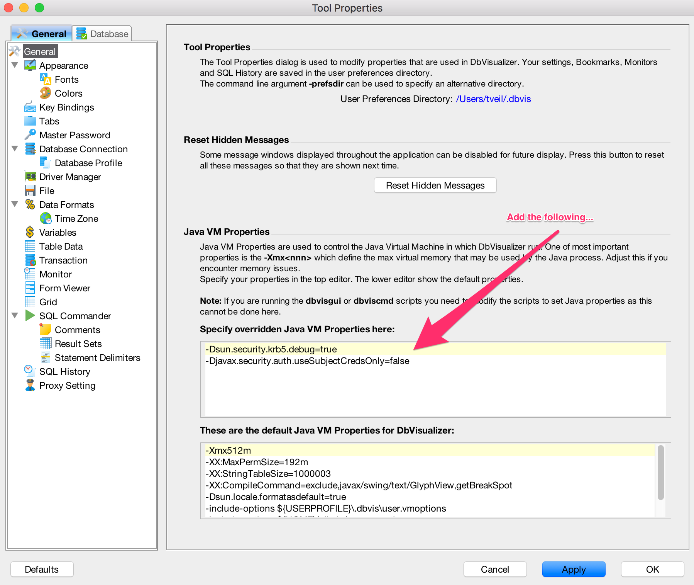
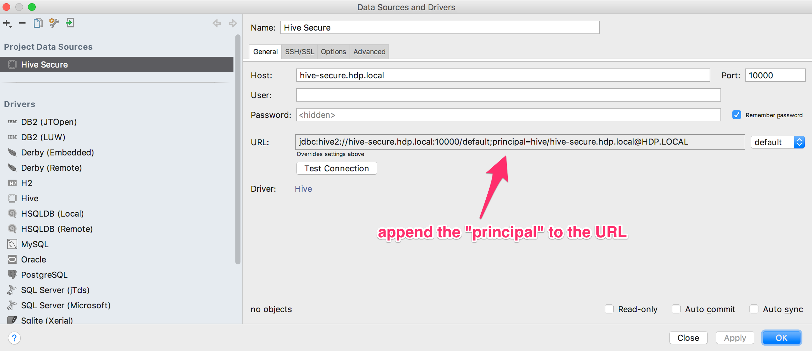

# Overview
Sometimes you want to connect your favorite database query or visualization tool to Hive. I've found that this can be quite cumbersome, typically requiring you to copy jars from the Hadoop cluster to some place locally that can be read by your tool. The goal of this simple maven project is to easily pull the required jars into a single place locally and create an "uber" or "standalone" jar that can be referenced by any JDBC compliant tool.

Please note this jar works with both kerberized and non-kerberized clusters.  Configuring tools to work against kerberized clusters is typically more involved and requires an understanding of Kerberos.  A full explanation of configuring Kerberos is outside the scope of this project.

You can download the latest binaries from the releases page:  https://github.com/timveil/hive-jdbc-uber-jar/releases

* Added support kerberized clusters - 12/19/16 - __LATEST__
* Updated for HDP 2.5.3.0 - 12/01/16
* Updated for HDP 2.5.0.0 - 09/12/16

# Non-kerberized Setup

## DbVisualizer (as of version 9.5.5)
Below is an example configuration using [DbVisualizer](http://www.dbvis.com/):

1. Open the Diver Manager dialog ("Tools" > "Driver Manager...") and hit the "Create a new driver" icon.

2. Fill in the information as seen below.  For the "Driver File Paths" you are pointing to `hive-jdbc-uber-x.jar`.  URL format should be `jdbc:hive2://<server>:<port10000>/<database>`

    

3. Create a new connection ("Database" > "Create Database Connection") and fill out the details based on your cluster as seen below.

    

4. Hit the "Connect" button to test the connection.  You should see something like the following in the "Connection Message" text area if the connection is successful.

    ```
    Apache Hive
    1.2.1000.2.5.3.0-37
    null
    null
    ```

## IntelliJ Data Grip (as of version 2016.3)
Below is an example configuration using IntelliJ [Data Grip](https://www.jetbrains.com/datagrip/):

1. Under "File" > "Data Sources...", first create a new Driver.

    

2. Then create a new Project Data Source using the new Driver.

    

3. After creating the Project Data Source, test the connection.  You should see the following:

    

# Kerberized Setup
Connecting a JDBC tool to a kerberized cluster is a bit more complicated than connecting to a non-kerberized cluster.  Before getting started, ensure the following:

* The `krb5.conf` file on your workstation matches the one on your cluster
* You have a valid kerberos principal that can access the appropriate services your custer
* You can succesfully `kinit` from your workstation against the realm specified in your `krb5.conf` file

    ```
    # for example, from my Mac, i execute the follwing command to authenticate to the kdc
    > kinit -t /[path to my keytab]/tveil.keytab
    ```

## DbVisualizer (as of version 9.5.5)
Below is an example configuration using [DbVisualizer](http://www.dbvis.com/) against a kerberized cluster:

1. As of DbVisualizer 9.5.5 for Mac, attempting to connect to a kerberized cluster will cause the following exception, `Illegal Hadoop Version: Unknown (expected A.B.* format)`.  This can be avoided by creating a file called `common-version-info.properties` and placing it the following directory `/Applications/DbVisualizer.app/Contents/java/app/resources`.  You can download a copy of the file [here](etc/common-version-info.properties) or add the following contents:

    ```
    version=2.7.3.2.5.3.0-37
    revision=
    branch=
    user=
    date=
    url=
    srcChecksum=
    protocVersion=2.5.0
    ```

2. `kinit` with an appropriate principal and launch DbVisualizer

4. Open DbVisualizer preferences ("DbVisualizer" > "Preferences") and add the following properties.  DbVisualizer will need to be restarted after applying these changes.

    ```
    -Dsun.security.krb5.debug=true
    -Djavax.security.auth.useSubjectCredsOnly=false
    ```

    

3. Open the Diver Manager dialog ("Tools" > "Driver Manager...") and hit the "Create a new driver" icon.

4. Fill in the information as seen below.  For the "Driver File Paths" you are pointing to `hive-jdbc-uber-x.jar`.  URL format should be `jdbc:hive2://<server>:<port10000>/<database>`

    

5. Create a new connection ("Database" > "Create Database Connection") and fill out the details based on your cluster as seen below.  Please note that you must append the "principal" to the "database" parameter for kerberized connections.

    

6. Hit the "Connect" button to test the connection.  You should see something like the following in the "Connection Message" text area if the connection is successful.

    ```
    Apache Hive
    1.2.1000.2.5.3.0-37
    null
    null
    ```

## IntelliJ Data Grip (as of version 2016.3)
Below is an example configuration using IntelliJ [Data Grip](https://www.jetbrains.com/datagrip/):

1. `kinit` with an appropriate principal and launch DataGrip

2. Under "File" > "Data Sources...", first create a new Driver.

    

3. Then create a new Project Data Source using the new Driver.

    

    

4. After creating the Project Data Source, test the connection.  You should see the following:

    

# How to Build
To build locally, you must have Maven installed and properly configured.  After that it's as simple as running `mvn:package`.  A file called `hive-jdbc-uber-x.jar` will be created in your `target` directory.  The newly created jar will have the Hive JDBC driver as well as all required dependencies.
